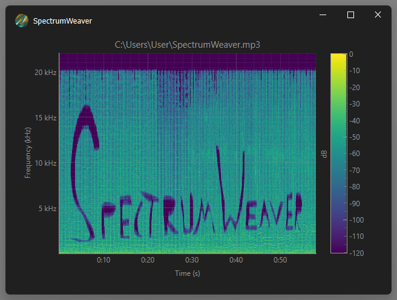

<div align="center">
  
  
  <h3><b>SpectrumWeaver</b>: Real-Time Acoustic Spectrum Analyzer</h3>
  
  <p>
    <em>A powerful, modern spectrum analyzer for audio files with real-time visualization and streaming capabilities</em>
  </p>
  
  
</div>

## Description
SpectrumWeaver is a sophisticated acoustic spectrum analyzer built with Python and Qt. It provides real-time visualization of audio spectrograms with streaming capabilities, allowing users to analyze audio files progressively without loading entire files into memory. The application features a modern, frameless window design with custom controls and interactive visualization tools.

## Key Features
- **Real-Time Streaming Analysis**: Process large audio files progressively without memory constraints
- **Interactive Spectrogram Visualization**: High-performance rendering using PyQtGraph
- **Multiple Audio Format Support**: WAV, MP3, FLAC, OGG, M4A, AAC
- **Drag & Drop Interface**: Simply drag audio files onto the application
- **Customizable Analysis Parameters**: Adjustable batch size and plot colormaps
- **Custom Context Menu**: Right-click for analysis settings and export options
- **Modern UI Design**: Frameless window with custom title bar and styling
- **Thread-Safe Processing**: Smooth UI performance during intensive computations

## Project Structure
```
SpectrumWeaver/
├── src/
│   ├── spectrum_weaver.py          # Main application entry point
│   ├── analyzers/
│   │   ├── __init__.py
│   │   └── spectrum_analyzer.py    # Core spectrum analysis engine
│   ├── gui/
│   │   ├── __init__.py
│   │   ├── spectrum_viewer.py      # Main visualization widget
│   │   ├── custom_title_bar.py     # Custom window title bar
│   │   ├── custom_context_menu.py  # Right-click context menu
│   │   └── custom_axes_items.py    # Custom time/frequency axis items
│   └── assets/
│       ├── icon.png                # Application icon
│       ├── resources.py            # Qt resource file
│       ├── resources.qrc           # Qt resource configuration
│       └── styles.qss              # Application stylesheet
├── tests/                          # Comprehensive test suite
├── images/                         # Documentation images
├── tools/                          # Build and utility scripts
├── pyproject.toml                  # Project configuration
├── uv.lock                         # Dependency lock file
└── README.md                       # This file
```

## Getting Started

### Prerequisites

- Python 3.13 or higher
- Windows, macOS, or Linux operating system
- Audio files in supported formats (WAV, MP3, FLAC, OGG, M4A, AAC)

### Installation

1. **Clone the repository:**
   ```bash
   git clone https://github.com/yourusername/SpectrumWeaver.git
   cd SpectrumWeaver
   ```

2. **Install dependencies using uv (recommended):**
   ```bash
   uv sync
   ```

   Or using pip:
   ```bash
   pip install -e .
   ```

3. **Install development dependencies (optional):**
   ```bash
   uv sync --group dev
   ```

### Running the Application

#### From Source
```bash
# Using uv
uv run python src/spectrum_weaver.py

# Using Python directly
python src/spectrum_weaver.py
```

## Usage

1. **Launch SpectrumWeaver**
2. **Load an audio file** by dragging and dropping a file onto the application window
3. **View the real-time spectrogram** as it processes
4. **Interact with the visualization**:
   - Zoom and pan using mouse controls
   - Right-click for context menu options: file details and app settings
   - Adjust analysis parameters

## Technologies

### Core Technologies
- **Python 3.13+**: Modern Python with latest features
- **PySide6**: Qt6 bindings for Python GUI development
- **PyQtGraph**: High-performance scientific plotting library
- **NumPy**: Numerical computing and array operations
- **Librosa**: Audio processing and feature extraction
- **SciPy**: Scientific computing and signal processing

### Additional Libraries
- **qframelesswindow**: Custom frameless window implementation
- **Mutagen**: Audio metadata extraction
- **Humanize**: Human-readable data formatting

### Development Tools
- **pytest**: Testing framework with Qt support
- **PyInstaller**: Application packaging and distribution
- **auto-py-to-exe**: GUI for PyInstaller
- **uv**: Fast Python package manager